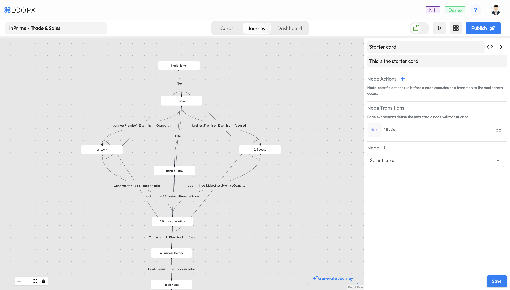
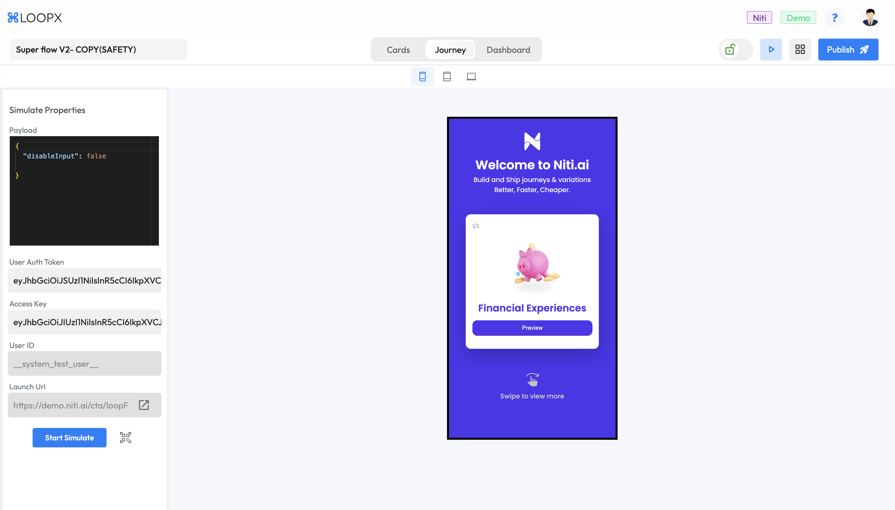
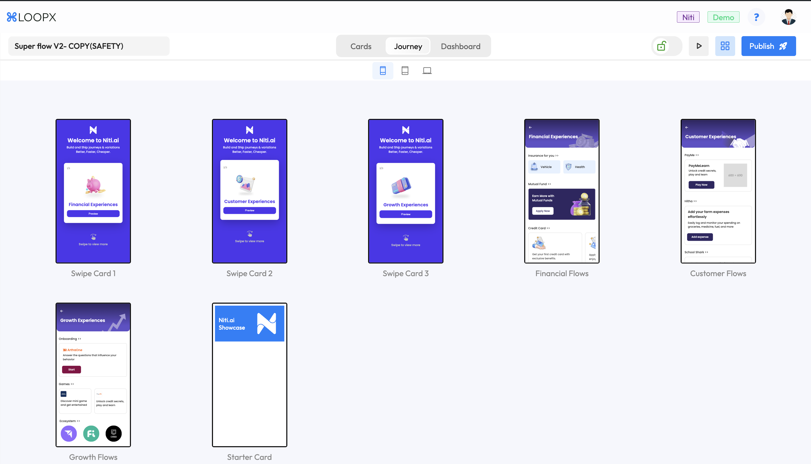

import CardGroup from '@site/src/components/CardGroup';
import Card from '@site/src/components/Card';

# Flow Builder

## The Fun and Fast Way to Build Front-Ends.

Flow Builder is your go-to tool for creating stunning front-end interfaces without writing a single line of code.
Think of Flow Builder as your app’s interior decorator. It lets you design stunning interfaces, map out user journeys, and test everything to perfection—all without coding. It’s like having a design studio right at your fingertips.

## Card

A single screen in your app where all the magic happens. Each Card represents a snapshot of your app’s interface.

### Card Creation Methods:

<CardGroup>
  <Card
    title="Figma to Card"
    href="/docs/experience-layer/flow-builder"
    icon="/img/figma_logo.svg"
  >
Convert Figma designs into app-ready Cards in a few clicks.
</Card>
<Card
title="Screenshot to Card"
href=""
icon="/img/screenshot.svg">
Snap a screenshot and instantly turn it into a Card.
</Card>

<Card
title="Prompt to Card"
href=""
icon="/img/chat.svg">
Type your prompts and let Flow Builder create Cards for you.
</Card>
</CardGroup>

## Journey

Map out user experiences with intuitive graphs. Visualize the entire user adventure with ease.

## Simulate

Test your flow to ensure everything works perfectly before going live. It’s your chance to iron out any issues.

## Gallery View

See all your Cards at once, just like flipping through slides in Google Slides. Get a comprehensive view of your design.

## UI Checks

Ensure your design meets accessibility standards and other technical requirements. It’s like having a personal QA team to catch those pesky issues before they become a problem.
